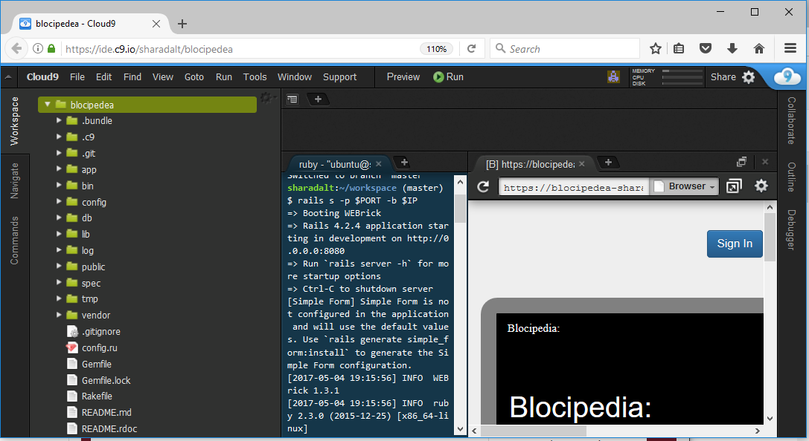

<h1>Blocipedea</h1>
Wikis are a great way to collaborate on community-sourced content. 

Whether the wiki is for a hobby or work-related project, Blocipedia an app that lets users create their own wikis and share them publicly or privately with other collaborators.

<h2>Use Case </h2>
 For the use case, goto the link, https://sharadalt.github.io/portfolio/blocipedia
 
<h2>Configuration</h2>

    

 

<h2>How to run it </h2>

To start the application you run it like any other rails application with the command, first start the rails server
 $ rails s and goto the localhost:3000, to make sure the app is running locally.
 
 On Cloud9 running rails is as below: 
 
 $ rails s -p $PORT -b $IP
 
 And to make sure the app is running, click on preview tab and select 'Preview Running application'.
